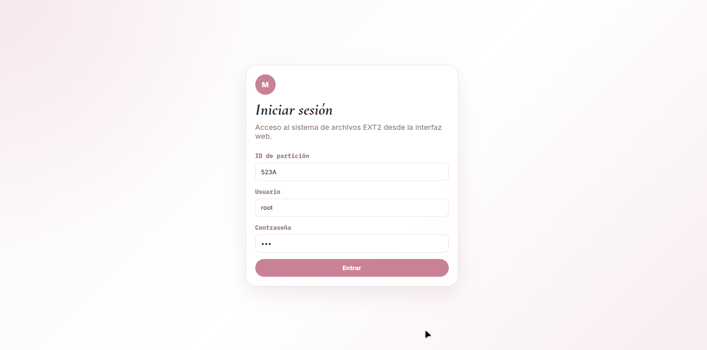
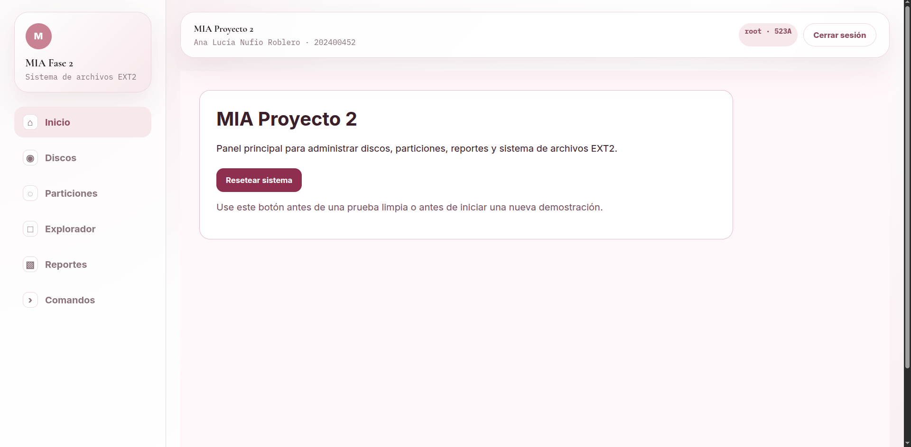
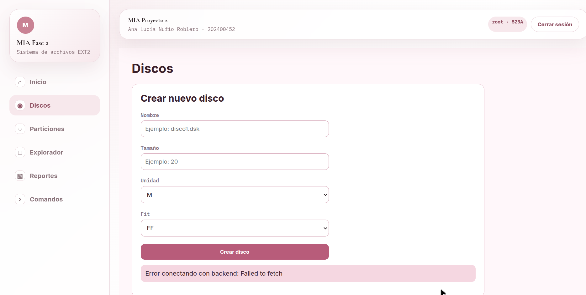
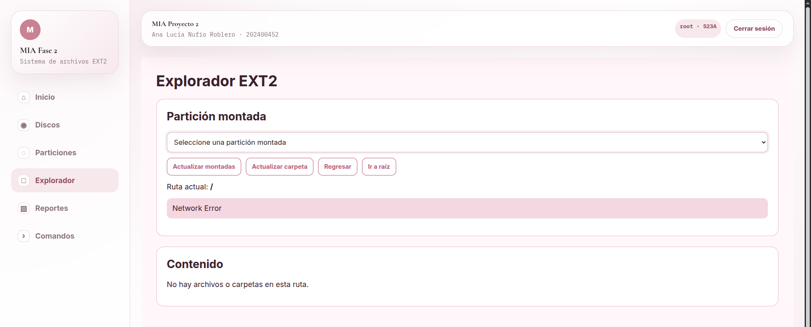
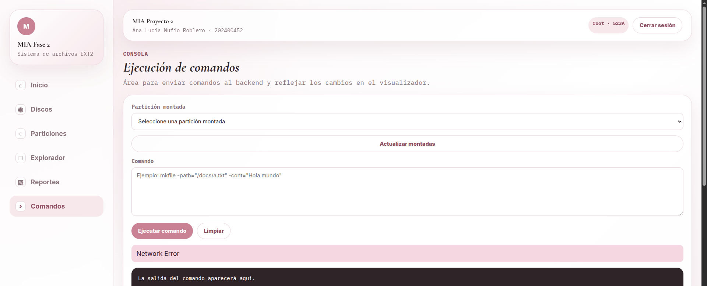

# Manual de Usuario  
## Proyecto Fase 2 - MIA

**Nombre:** Ana Lucía Nufio Roblero 
**Carnet:** 202400452 
**Curso:** Manejo e Implementación de Archivos 
**Proyecto:** Fase 2 


## 1. Introducción

Este manual explica cómo utilizar la interfaz gráfica del Proyecto Fase 2. 
El sistema permite administrar discos, particiones, inicio de sesión, exploración del sistema de archivos, ejecución de comandos y visualización de reportes.

La aplicación está diseñada para facilitar el uso del sistema de archivos EXT2 mediante una interfaz web, evitando que el usuario tenga que ejecutar todo únicamente desde consola.


## 2. Requisitos para usar el sistema

Antes de usar la aplicación, se debe tener:

- Backend ejecutándose.
- Frontend ejecutándose o desplegado.
- Un navegador web.
- Permisos para crear discos y reportes.
- Una partición montada y formateada para iniciar sesión.


## 3. Pantalla de inicio de sesión

Al abrir el sistema, se muestra la pantalla de login.

En esta pantalla se debe ingresar:

- ID de la partición montada.
- Usuario.
- Contraseña.

Credenciales base después de formatear una partición:

```text
Usuario: root
Contraseña: 123
```




## 4. Página principal

Después de iniciar sesión, el sistema muestra la interfaz principal. 
Desde esta pantalla se puede navegar hacia las diferentes secciones del sistema:

- Discos.
- Particiones.
- Explorador de archivos.
- Consola de comandos.
- Reportes.





## 5. Gestión de discos

La sección de discos permite administrar los discos virtuales del sistema.

Desde esta pantalla se puede:

- Crear un disco.
- Eliminar un disco.
- Seleccionar un disco existente.
- Ver la lista de discos creados.


### 5.1 Crear disco

Para crear un disco:

1. Ir a la sección **Discos**.
2. Presionar el botón para crear disco.
3. Ingresar el nombre del disco.
4. Ingresar el tamaño.
5. Seleccionar la unidad.
6. Confirmar la creación.

El sistema creará un archivo `.dsk`.





### 5.2 Eliminar disco

Para eliminar un disco:

1. Ir a la sección **Discos**.
2. Buscar el disco que se desea eliminar.
3. Presionar la opción de eliminar.
4. Confirmar la eliminación.


## 6. Gestión de particiones

La sección de particiones permite administrar las particiones dentro de un disco.

Desde esta pantalla se puede:

- Crear particiones.
- Eliminar particiones.
- Montar particiones.
- Desmontar particiones.
- Formatear particiones.
- Redimensionar particiones.


### 6.1 Crear partición

Para crear una partición:

1. Seleccionar un disco.
2. Ir a la sección **Particiones**.
3. Presionar la opción para crear partición.
4. Ingresar el nombre.
5. Ingresar el tamaño.
6. Seleccionar la unidad.
7. Seleccionar el tipo de partición:
   - Primaria.
   - Extendida.
   - Lógica.
8. Seleccionar el ajuste:
   - Best Fit.
   - First Fit.
   - Worst Fit.
9. Confirmar la creación.


### 6.2 Eliminar partición

Para eliminar una partición:

1. Seleccionar el disco.
2. Ir a la sección **Particiones**.
3. Buscar la partición.
4. Seleccionar eliminar.
5. Elegir el tipo de eliminación si aplica:
   - Fast.
   - Full.
6. Confirmar la eliminación.


### 6.3 Montar partición

Para montar una partición:

1. Ir a la lista de particiones.
2. Seleccionar la partición.
3. Presionar **Montar**.
4. El sistema asignará un ID de montaje.

Ejemplo de ID:

```text
521A
```


### 6.4 Desmontar partición

Para desmontar una partición:

1. Ir a la lista de particiones montadas.
2. Seleccionar la partición.
3. Presionar **Desmontar**.
4. El sistema quitará la partición de la lista de montadas.


### 6.5 Formatear partición

Para formatear una partición:

1. La partición debe estar montada.
2. Seleccionar la partición montada.
3. Presionar **Formatear**.
4. Confirmar la operación.
5. El sistema creará la estructura EXT2.

Después de formatear se podrá iniciar sesión con:

```text
Usuario: root
Contraseña: 123
```


## 7. Explorador del sistema de archivos

El explorador permite navegar visualmente dentro de la partición formateada.

Desde esta pantalla se puede:

- Ver la carpeta raíz `/`.
- Entrar a carpetas.
- Volver a carpetas anteriores.
- Ver archivos.
- Leer contenido de archivos.
- Actualizar el contenido mostrado.


### 7.1 Abrir la raíz

Al seleccionar una partición formateada, el explorador inicia desde:

```text
/
```


### 7.2 Abrir carpetas

Para abrir una carpeta:

1. Ubicar la carpeta en el explorador.
2. Presionar sobre ella.
3. El sistema mostrará su contenido.


### 7.3 Ver contenido de archivos

Para ver un archivo:

1. Ubicar el archivo en el explorador.
2. Presionar sobre el archivo.
3. El sistema mostrará el contenido en pantalla.





## 8. Consola de comandos

La consola permite ejecutar comandos desde la interfaz web. 
Antes de usarla, se debe seleccionar una partición montada y formateada.

Comandos disponibles:

```text
mkdir
mkfile
edit
rename
remove
copy
move
```





---

## 9. Reportes

La sección de reportes permite visualizar el estado interno del disco y del sistema de archivos.

Reportes disponibles:

- MBR.
- Disk.
- Tree.
- Inode.
- Block.
- Bitmap de inodos.
- Bitmap de bloques.
- Superbloque.


