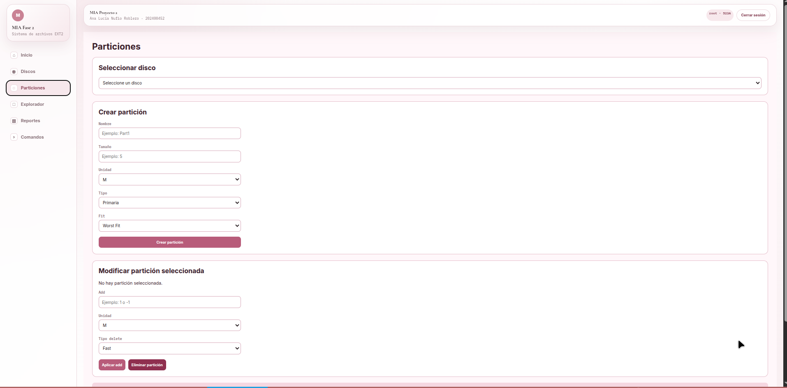
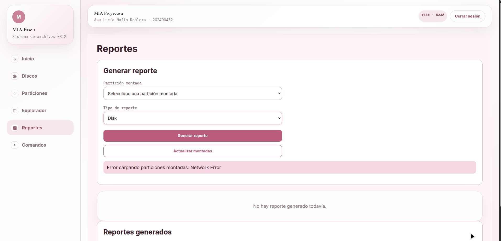

# Manual de Usuario
## Proyecto Fase 2 - MIA

**Nombre:** Ana Lucía Nufio Roblero  
**Carnet:** 202400452  
**Curso:** Manejo e Implementación de Archivos  
**Proyecto:** Fase 2  

---

## 1. Introducción

Este manual explica cómo utilizar la interfaz gráfica del Proyecto Fase 2.

El sistema permite administrar discos, particiones, inicio de sesión, exploración del sistema de archivos, operaciones sobre archivos y carpetas, y visualización de reportes desde una aplicación web.

La aplicación está diseñada para facilitar el uso del sistema de archivos EXT2 mediante una interfaz gráfica, evitando que el usuario tenga que depender de una terminal externa para ejecutar las operaciones principales.

---

## 2. Requisitos para usar el sistema

Antes de usar la aplicación, se debe tener:

- Backend ejecutándose.
- Frontend ejecutándose o desplegado.
- Un navegador web.
- Permisos para crear discos y reportes.
- Graphviz instalado en el backend para generar reportes visuales.
- Una partición montada y formateada para iniciar sesión y explorar el sistema EXT2.

---

## 3. Flujo general del sistema

El flujo correcto de uso es:

1. Abrir la aplicación web.
2. Crear un disco.
3. Seleccionar el disco.
4. Crear una partición.
5. Montar la partición.
6. Formatear la partición.
7. Iniciar sesión con el usuario creado por el formateo.
8. Entrar al explorador del sistema de archivos.
9. Crear, editar, renombrar, copiar, mover o eliminar archivos y carpetas desde la interfaz.
10. Visualizar los reportes desde la pestaña de reportes.

> El sistema no solicita login al inicio porque antes de formatear una partición todavía no existe el archivo `users.txt` ni el usuario `root`.

---

## 4. Página principal

Al abrir el sistema se muestra la página principal de la aplicación.

Desde esta pantalla se puede navegar hacia las diferentes secciones del sistema:

- Discos.
- Particiones.
- Explorador.
- Reportes.
- Login, cuando ya exista una partición montada y formateada.


---

## 5. Gestión de discos

La sección de discos permite administrar los discos virtuales del sistema.

Desde esta pantalla se puede:

- Crear un disco.
- Eliminar un disco.
- Seleccionar un disco existente.
- Ver la lista de discos creados.
- Visualizar reportes relacionados con el disco.

### 5.1 Crear disco

Para crear un disco:

1. Ir a la sección **Discos**.
2. Ingresar el nombre del disco.
3. Ingresar el tamaño.
4. Seleccionar la unidad.
5. Confirmar la creación.

El sistema creará un archivo `.dsk`.

Después de crear el disco, se puede visualizar el reporte MBR o Disk desde la interfaz.


### 5.2 Seleccionar disco

Para trabajar con un disco:

1. Ir a la sección **Discos**.
2. Buscar el disco creado.
3. Presionar **Seleccionar**.
4. Luego ir a la sección **Particiones**.

### 5.3 Eliminar disco

Para eliminar un disco:

1. Ir a la sección **Discos**.
2. Buscar el disco que se desea eliminar.
3. Presionar la opción de eliminar.
4. Confirmar la eliminación.

Al eliminar un disco, también se limpian los reportes generados para evitar que la pestaña de reportes muestre archivos antiguos.

---

## 6. Gestión de particiones

La sección de particiones permite administrar las particiones dentro del disco seleccionado.

Desde esta pantalla se puede:

- Crear particiones.
- Montar particiones.
- Desmontar particiones.
- Formatear particiones.
- Aumentar o reducir espacio.
- Eliminar particiones.
- Ver el estado de cada partición.

Las acciones principales aparecen directamente en cada tarjeta de partición. Esto permite usar el sistema por medio de botones y formularios, sin escribir comandos manualmente en una terminal externa.



### 6.1 Crear partición

Para crear una partición:

1. Seleccionar un disco.
2. Ir a la sección **Particiones**.
3. Ingresar el nombre de la partición.
4. Ingresar el tamaño.
5. Seleccionar la unidad.
6. Seleccionar el tipo:
   - Primaria.
   - Extendida.
   - Lógica.
7. Seleccionar el ajuste:
   - Best Fit.
   - First Fit.
   - Worst Fit.
8. Confirmar la creación.

### 6.2 Montar partición

Para montar una partición:

1. Ir a la lista de particiones.
2. Ubicar la tarjeta de la partición.
3. Presionar **Montar**.
4. El sistema asignará un ID de montaje.

Ejemplo de ID:

```text
521A
```

### 6.3 Desmontar partición

Para desmontar una partición:

1. Ir a la tarjeta de la partición montada.
2. Presionar **Desmontar**.
3. El sistema quitará la partición de la lista de montadas.

### 6.4 Formatear partición

Para formatear una partición:

1. La partición debe estar montada.
2. Ubicar la partición en la lista.
3. Presionar **Formatear**.
4. Confirmar la operación.
5. El sistema creará la estructura EXT2.

Después de formatear se genera el archivo `users.txt` y se puede iniciar sesión con:

```text
Usuario: root
Contraseña: 123
```

### 6.5 Cambiar espacio de una partición

Cada tarjeta de partición tiene botones para cambiar su tamaño:

- **Aumentar +1 MB**
- **Reducir -1 MB**

Estas acciones corresponden internamente a la funcionalidad de agregar o quitar espacio, pero se ejecutan desde la interfaz gráfica.

### 6.6 Eliminar partición

Cada tarjeta de partición tiene opciones para eliminar:

- **Eliminar rápida**
- **Eliminar completa**

La eliminación rápida marca el espacio como disponible.  
La eliminación completa limpia el espacio de la partición.

---

## 7. Inicio de sesión

El login no aparece como primer paso del sistema.

El inicio de sesión se utiliza después de haber creado, montado y formateado una partición, porque hasta ese momento existe el archivo `users.txt` con el usuario base.

Para iniciar sesión:

1. Ir a la pantalla de **Login**.
2. Seleccionar o ingresar el ID de la partición montada.
3. Ingresar usuario.
4. Ingresar contraseña.
5. Confirmar.

Credenciales base después de formatear:

```text
Usuario: root
Contraseña: 123
```


---

## 8. Explorador del sistema de archivos

El explorador permite navegar visualmente dentro de la partición formateada.

Desde esta pantalla se puede:

- Ver la carpeta raíz `/`.
- Entrar a carpetas.
- Volver a carpetas anteriores.
- Ver archivos.
- Leer contenido de archivos.
- Crear carpetas.
- Crear archivos.
- Editar archivos.
- Renombrar archivos o carpetas.
- Copiar archivos o carpetas.
- Mover archivos o carpetas.
- Eliminar archivos o carpetas.
- Actualizar el contenido mostrado.


### 8.1 Abrir la raíz

Al ingresar al explorador, el sistema inicia desde:

```text
/
```

### 8.2 Abrir carpetas

Para abrir una carpeta:

1. Ubicar la carpeta en el explorador.
2. Presionar sobre ella.
3. El sistema mostrará su contenido.

### 8.3 Ver contenido de archivos

Para ver un archivo:

1. Ubicar el archivo en el explorador.
2. Presionar sobre el archivo.
3. El sistema mostrará el contenido en pantalla.

### 8.4 Crear carpeta

Para crear una carpeta:

1. Estar dentro del explorador.
2. Ingresar el nombre de la carpeta.
3. Presionar **Crear carpeta**.
4. El explorador se actualizará.

### 8.5 Crear archivo

Para crear un archivo:

1. Estar dentro del explorador.
2. Ingresar el nombre del archivo.
3. Ingresar el contenido.
4. Presionar **Crear archivo**.
5. El archivo aparecerá en la carpeta actual.

### 8.6 Editar archivo

Para editar un archivo:

1. Seleccionar el archivo.
2. Presionar **Editar**.
3. Cambiar el contenido.
4. Guardar los cambios.

### 8.7 Renombrar archivo o carpeta

Para renombrar:

1. Seleccionar archivo o carpeta.
2. Presionar **Renombrar**.
3. Ingresar el nuevo nombre.
4. Confirmar.

### 8.8 Copiar archivo o carpeta

Para copiar:

1. Seleccionar archivo o carpeta.
2. Presionar **Copiar**.
3. Ingresar la ruta destino.
4. Confirmar.

### 8.9 Mover archivo o carpeta

Para mover:

1. Seleccionar archivo o carpeta.
2. Presionar **Mover**.
3. Ingresar la ruta destino.
4. Confirmar.

### 8.10 Eliminar archivo o carpeta

Para eliminar:

1. Seleccionar archivo o carpeta.
2. Presionar **Eliminar**.
3. Confirmar la operación.


---

## 9. Reportes

La sección de reportes permite visualizar el estado interno del disco y del sistema de archivos.

Reportes disponibles:

- MBR.
- Disk.
- Tree.
- Inode.
- Block.
- Bitmap de inodos.
- Bitmap de bloques.
- Superbloque.



### 9.1 Reportes de disco

Para generar reportes de disco:

1. Ir a la sección **Reportes**.
2. Seleccionar un disco.
3. Presionar el reporte deseado:
   - MBR.
   - Disk.
4. Presionar **Abrir** para visualizarlo.

### 9.2 Reportes de sistema de archivos

Para generar reportes del sistema de archivos:

1. Tener una partición montada y formateada.
2. Ir a la sección **Reportes**.
3. Seleccionar la partición.
4. Generar el reporte deseado:
   - Tree.
   - Inode.
   - Block.
   - Bitmap de inodos.
   - Bitmap de bloques.
   - Superbloque.
5. Presionar **Abrir** para visualizarlo.

### 9.3 Reportes generados

La aplicación muestra una lista de reportes generados.

Desde esta lista se puede:

- Ver el tipo de reporte.
- Ver la ruta del archivo.
- Abrir el reporte en pantalla.

Al eliminar un disco, los reportes generados se limpian para no mostrar reportes viejos.


